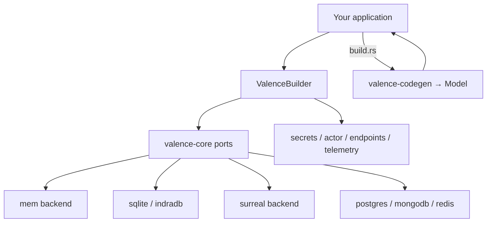

# Valence

[](https://github.com/unified-field-dev/valence/actions/workflows/ci.yml)
[](https://crates.io/crates/uf-valence)
[](https://docs.rs/uf-valence)
[](https://crates.io/crates/uf-valence)
[](LICENSE)

[GitHub](https://github.com/unified-field-dev/valence) · [crates.io](https://crates.io/crates/uf-valence) · [docs.rs](https://docs.rs/uf-valence) · `cargo doc -p uf-valence --all-features --open`

**Valence** is a schema-driven ORM for Rust: privacy-aware models, composable storage adapters, and host-injectable ports. Wire backends at boot via **`Valence::builder()`** — trait ports in `valence-core`, engines in feature-gated `valence-backend-*` crates.

*Typed schemas and models without locking you into one database.*

**Status:** v0.1.1 · MIT · crates.io package **`uf-valence`** (the name `valence` is taken); Rust imports stay `use valence::…`.

## Schema DSL

```rust
use std::sync::Arc;
use valence::{
    Database, DatabaseFromEngine, FieldType, InMemoryBackend, Valence, MEM_ENGINE_ID,
    valence_schema,
};

const COUNTER_DB: DatabaseFromEngine = Database::from_engine("default", MEM_ENGINE_ID);

valence_schema! {
    Counter {
        table: "counter",
        version: "0.1.0",
        description: "Simple counter",
        database: COUNTER_DB,
        fields: [
            id: { r#type: FieldType::String, primary_key: true, required: true },
            value: { r#type: FieldType::Integer, required: true },
        ],
    }
}

let valence = Valence::builder()
    .add_backend("default", Arc::new(InMemoryBackend::new()))
    .build()?;
```

`database:` selects a logical name plus engine. The logical name (`"default"`) must match
`.add_backend("default", …)`. Replace `MEM_ENGINE_ID` with the selected adapter’s engine constant
for SQLite, IndraDB, SurrealDB, Postgres, MongoDB, or Redis.

## Architecture



Your application owns schemas, codegen roots, and business logic. Valence owns the ORM surface: schema registry, privacy/ownership hooks, query routing, and the `DatabaseBackend` port. Storage engines live in separate adapter crates.

**Dependency rules**

1. `valence-core` defines ports and model/runtime semantics; it contains no engine SDK.
2. `valence-backend-*` crates implement storage and advertise an open `ENGINE_ID`.
3. The `valence` facade re-exports adapters behind Cargo features.
4. Applications own schema roots and invoke `valence-codegen` from `build.rs`.
5. One runtime may register heterogeneous backends; one operation stays on one backend.
6. Host-specific adapters remain outside core and are injected at boot.

## Quick start

Add the facade crate with the in-memory backend for local evaluation. The crates.io
package is **`uf-valence`** (the name `valence` is taken); imports stay `use valence::…`:

```toml
[dependencies]
valence = { package = "uf-valence", version = "0.1.1", features = ["mem"] }
tokio = { version = "1", features = ["rt-multi-thread", "macros"] }
```

From git (same package name):

```toml
[dependencies]
valence = { package = "uf-valence", git = "https://github.com/unified-field-dev/valence", features = ["mem"] }
```

Published crates use the `uf-*` package names on crates.io (`uf-valence`, `uf-valence-core`, …). Rust imports remain `use valence::…`.

```bash
cargo run -p uf-valence --example quickstart --features mem
cargo doc -p uf-valence --open
```

Follow the numbered **Getting started** guide in `cargo doc -p uf-valence` (wire → schema → codegen → Model CRUD → routing).

## Cargo features

| Feature | Backend | Notes |
|---------|---------|-------|
| `mem` | `valence-backend-mem` | **Default** — quick start, non-durable |
| `sqlite` | `valence-backend-sqlite` | Durable embedded |
| `indradb` | `valence-backend-indradb` | Embedded graph |
| `surreal` | `valence-backend-surreal` | Embedded Surreal (mem engine) |
| `surreal-rocksdb` | Surreal RocksDB | On-disk embedded |
| `surreal-remote` | Surreal remote | WebSocket/HTTP |
| `surreal-inventory` | Surreal helpers | Discover logical DB names from schemas |
| `surreal-connect-env` | Surreal helpers | `VALENCE_EMBEDDED_*` bootstrap |
| `postgres` | `valence-backend-postgres` | Wire — requires `DATABASE_URL` |
| `mongodb` | `valence-backend-mongodb` | Wire — requires `VALENCE_MONGODB_URI` |
| `redis` | `valence-backend-redis` | Wire — requires `VALENCE_REDIS_URL` |
| `telemetry-console` | `valence-telemetry` | Stderr telemetry sink |

### Limitations (read before integrating)

| Capability | Status |
|------------|--------|
| Generated Model CRUD | Requires host `build.rs` + `valence-codegen` (see `examples/codegen-host`) |
| Wire backends (postgres/mongodb/redis) | Need a live server URL; examples skip when unset |
| Cross-backend transactions | **Not supported** — batch ops stay on one backend |
| Privacy / ownership / deletion DAG | Schema-driven; see `examples/product-model-host` and crate rustdoc (`Model`, ownership, deletion) |
| Third-party engines | Implement `DatabaseBackend` in a separate crate — no facade change |

## Workspace crates

| Crate | Role |
|-------|------|
| `valence-core` | Traits, router, builder, Model, privacy |
| `valence-schema-dsl` | Shared syn DSL parser (macros + codegen) |
| `valence-macros` | `valence_schema!`, `valence_trait_schema!` |
| `valence-codegen` | Build-time model generation |
| `valence-backend-*` | Feature-gated storage adapters |
| `valence-telemetry` | `TelemetrySink` + reference sinks |
| `valence` | Public facade |
| `valence-testkit` / `valence-e2e` / `valence-bench` | Matrix verification and benchmarks |

## Documentation

| Doc | Audience |
|-----|----------|
| `cargo doc -p uf-valence --open` | Application developers — getting started, API map, examples |
| [`valence/README.md`](valence/README.md) | Integrators — feature flags, configuration precedence, env vars |
| [`valence-macros/README.md`](valence-macros/README.md) | Schema authors — DSL field reference |
| [`valence-codegen/README.md`](valence-codegen/README.md) | Build pipeline — model generation |
| [`examples/codegen-host/`](examples/codegen-host/) | End-to-end codegen → `Model` |
| [`examples/product-model-host/`](examples/product-model-host/) | Product-shaped schemas and connections |
| [`examples/acme-valence-backend-stub/`](examples/acme-valence-backend-stub/) | Third-party adapter checklist |
| `cargo doc -p uf-valence-core --open` | Adapter authors / host integrators — `DatabaseBackend`, `ports`, `ValenceBuilder` |
| Per-crate READMEs | Backend- and crate-specific entry points |

### Runnable examples

```bash
cargo run -p uf-valence --example quickstart --features mem
cargo run -p uf-valence --example multi_backend --features mem
cargo run -p uf-valence --example quickstart_sqlite --features sqlite
cargo run -p uf-valence --example quickstart_indradb --features indradb
cargo run -p uf-valence --example surreal_embedded --features surreal
cargo run -p uf-valence --example quickstart_telemetry --features mem,telemetry-console

# Wire (skip cleanly when URL unset):
DATABASE_URL=postgres://… cargo run -p uf-valence --example quickstart_postgres --features postgres
VALENCE_MONGODB_URI=mongodb://… cargo run -p uf-valence --example quickstart_mongodb --features mongodb
VALENCE_REDIS_URL=redis://… cargo run -p uf-valence --example quickstart_redis --features redis
```

### Maintainers

- [CONTRIBUTING.md](CONTRIBUTING.md) — verify commands and build guardrails before PRs
- [docs/VERIFICATION.md](docs/VERIFICATION.md) — test and coverage baseline
- [docs/E2E_BENCH_COVERAGE.md](docs/E2E_BENCH_COVERAGE.md) — feature × happy/sad/bench matrix
- [docs/AWS_E2E_BENCH_CAMPAIGN.md](docs/AWS_E2E_BENCH_CAMPAIGN.md) — AWS campaign runbook

## Composable storage (FAQ)

**Q: How do I add Postgres, Vault, or a custom engine?**  
Publish (or depend on) a crate that implements [`DatabaseBackend`](valence-core/src/backend/port.rs). Wire it with `.add_backend("logical", Arc::new(your_backend))` — no change to the `valence` facade features.

**Q: Can one `Valence` use multiple engines?**  
Yes. One [`DatabaseRouter`](valence-core/src/router.rs) holds heterogeneous backends. Schema `database:` evaluators pick the router key per table.

**Q: Where does SurrealDB live?**  
In the separate [`valence-backend-surreal`](valence-backend-surreal/) crate — never in `valence-core`.

See `cargo doc -p uf-valence-core` (`DatabaseBackend`, `ports`) and `examples/acme-valence-backend-stub`.

## Audience

- **Application developers** — import `valence` with `mem`; follow rustdoc Getting started; use codegen for `Model`.
- **Host integrators** — assemble `ValenceBuilder` at boot; register backends and inject ports.
- **Library maintainers** — see [CONTRIBUTING.md](CONTRIBUTING.md).

## Development

```bash
export CARGO_BUILD_JOBS=1 CARGO_TARGET_DIR=target-valence
./scripts/gate.sh
cargo test -p uf-valence-core -p uf-valence-telemetry -p uf-valence-macros -p uf-valence-backend-mem
RUSTDOCFLAGS="-D warnings" cargo doc -p uf-valence --all-features --no-deps
```

## License

MIT — see [LICENSE](LICENSE).
